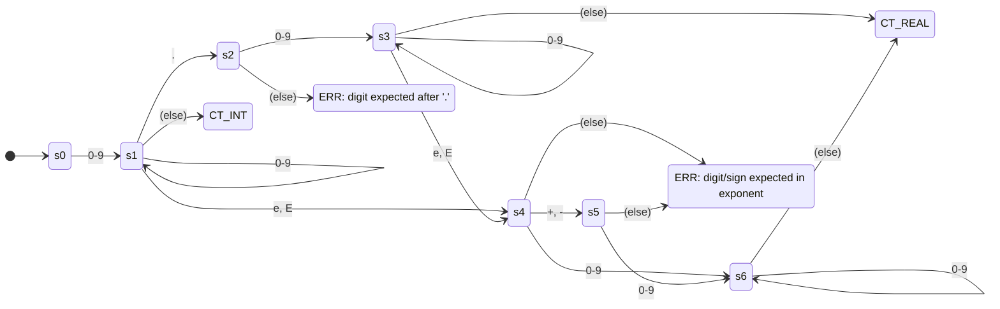
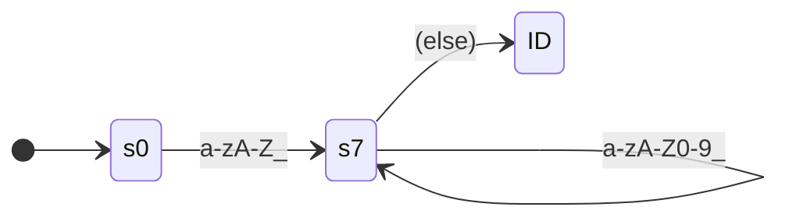
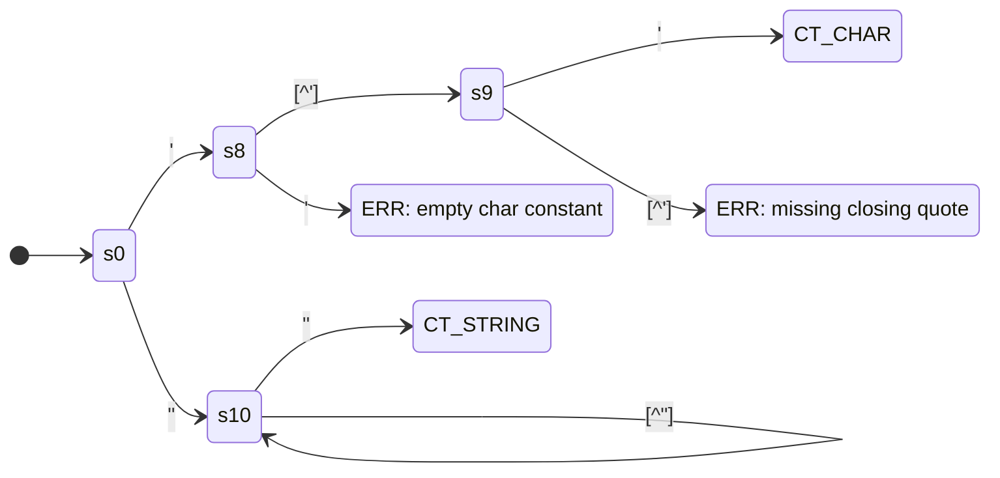
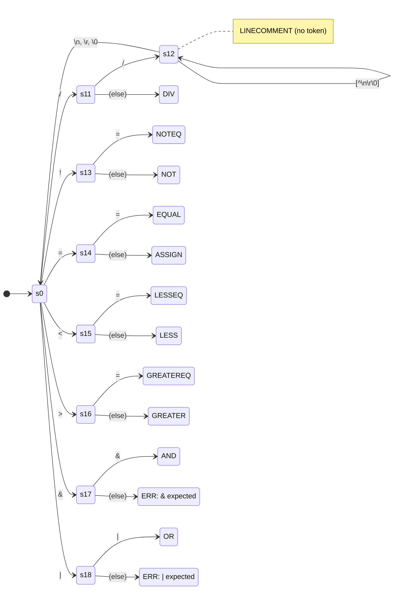
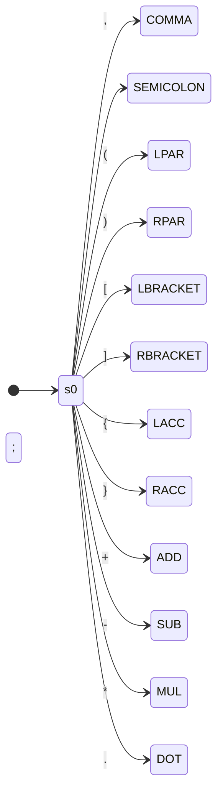
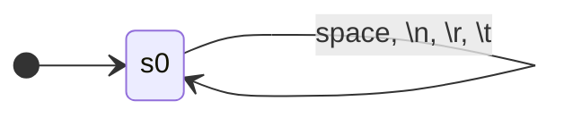

# AtomC - Transition Diagram (TD)

**Conventions:**
- `(else)` transitions do **NOT** consume the input character
- Final states (double circles) are labeled with the token name
- SPACE and LINECOMMENT loop back to state 0 (no token generated)
- Keywords are **not** on the TD — identified as special cases of ID
- Error states shown as rectangles
- Diagrams share state **0** as the common initial state (as per lab rules for complex TDs)

---

## 1. Numbers: CT_INT / CT_REAL (factorized)

---

## 2. Identifiers: ID

---

## 3. Character and String Constants: CT_CHAR, CT_STRING

---

## 4. Operators with Shared Prefixes (factorized)

---

## 5. Single-Character Delimiters and Operators

---

## 6. Whitespace and SPACE (no token generated)

---

## State Summary

| State | Description |
|-------|-------------|
| s0 | Initial state (shared across all diagrams) |
| s1 | After `[0-9]+` — number prefix shared by CT_INT and CT_REAL |
| s2 | After `[0-9]+ .` — decimal point, digit must follow |
| s3 | After `[0-9]+ . [0-9]+` — valid decimal part |
| s4 | After `[eE]` — exponent start |
| s5 | After `[eE] [+-]` — exponent sign, digit must follow |
| s6 | After exponent `[0-9]+` — valid exponent digits |
| s7 | After `[a-zA-Z_]` — in identifier |
| s8 | After `'` — expecting char content |
| s9 | After `' [^']` — expecting closing `'` |
| s10 | After `"` — in string body |
| s11 | After `/` — DIV or LINECOMMENT |
| s12 | In line comment `//...` — consuming until end of line |
| s13 | After `!` — NOT or NOTEQ |
| s14 | After `=` — ASSIGN or EQUAL |
| s15 | After `<` — LESS or LESSEQ |
| s16 | After `>` — GREATER or GREATEREQ |
| s17 | After `&` — expecting second `&` |
| s18 | After `|` — expecting second `|` |

## Factorizations Applied

1. **CT_INT / CT_REAL** — both start with `[0-9]+` → factorized through s1
2. **DIV / LINECOMMENT** — both start with `/` → factorized through s11
3. **NOT / NOTEQ** — both start with `!` → factorized through s13
4. **ASSIGN / EQUAL** — both start with `=` → factorized through s14
5. **LESS / LESSEQ** — both start with `<` → factorized through s15
6. **GREATER / GREATEREQ** — both start with `>` → factorized through s16
